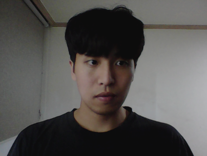
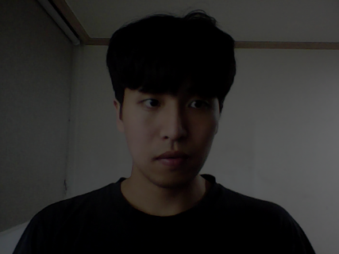
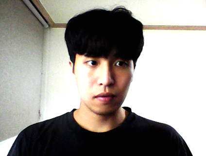
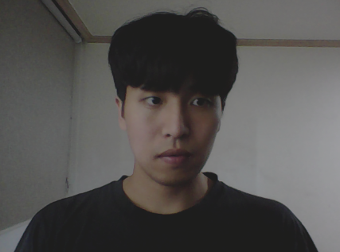
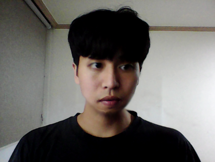
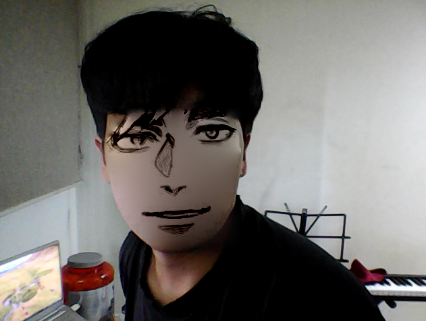
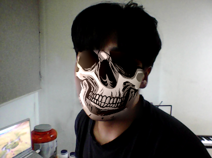
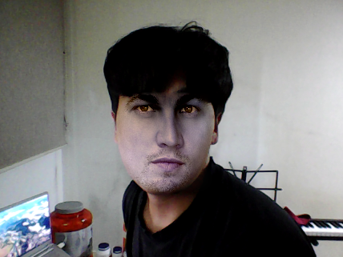
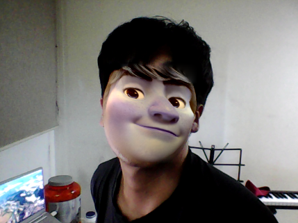

# Self Camera Application

### 1. Contens  
    1) Inspired by Self Revising Camera APP.  
    2) Can take Video and picture with this APP.  
    3) Can modulate brightness, contrast of image.  
    4) It has blur effect on certain position on my face.  
    5) It can make panorama picture.  
    6) It can change face with some special character.  
### 2. Setting  
    1) Needed Tkinter, Pillow, OpenCV-Python, Numpy, Dlib library.  
### 3. self_camera_application.py  
    1) It has one class and just declare.
### 4. Language  
    1) Python  
### 5. Result  
    1) face  
  
    
    2) brighness+40
  

    3) brighness-40

    4) contrast+40
  

    5) contrast-40
 

    6) blur and liquify
  

    7) face change
  
  
  
