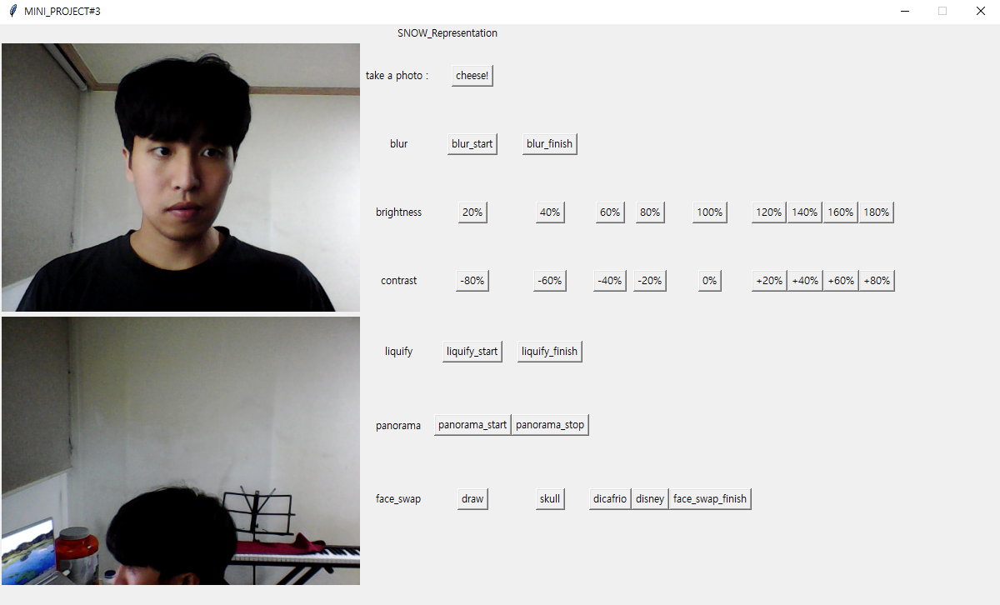
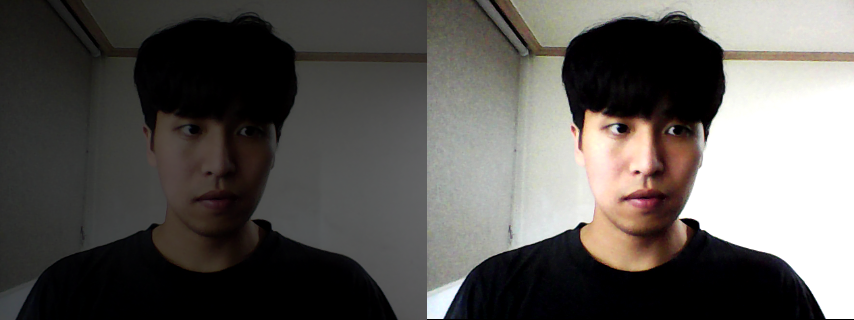
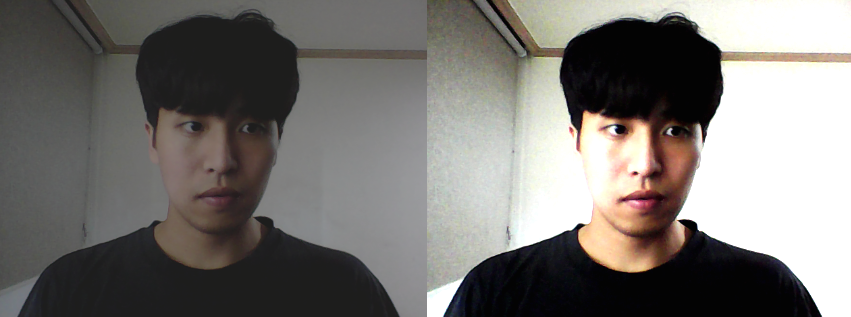

# Self Camera Application

## 1. Contents

    1) Inspired by Self Revising Camera APP.
    2) Can take Video and picture with this APP.
    3) Can modulate brightness, contrast of image.
    4) It has blur effect on certain position on my face.
    5) It can make panorama picture.
    6) It can change face with some special character.

## 2. Setting

1. Needed Tkinter, Pillow, OpenCV-Python, Numpy, Dlib library.
2. Download shape_predictor_68_face_landmarks.dat file to use dlib Landmark points.

## 3. File1: self_camera_application Process

1. It has one class and just declare.

## 4. File2: image_absortion Process

1. Function of image absortion for output image.

## 5. Language

1. Python

## 6. Result

1. APP
   

2. face
   

3. brighness
   

4. contrast
   

5. blur and liquify
   

6. face change
     
     
     
   
